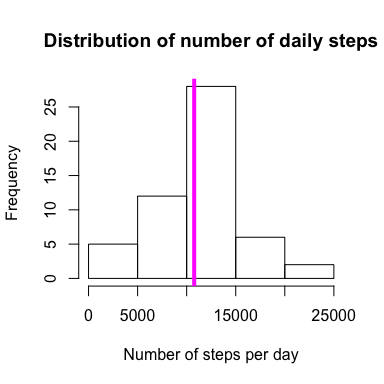
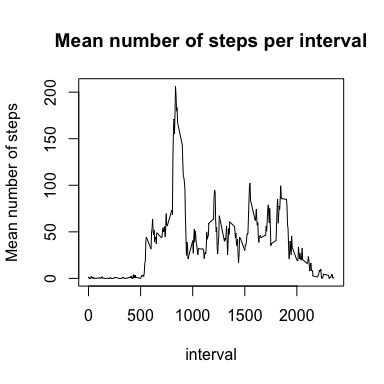
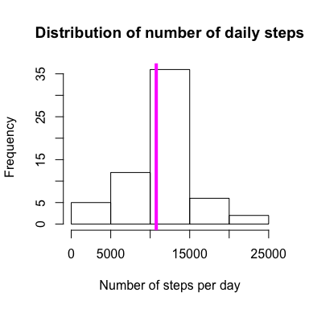
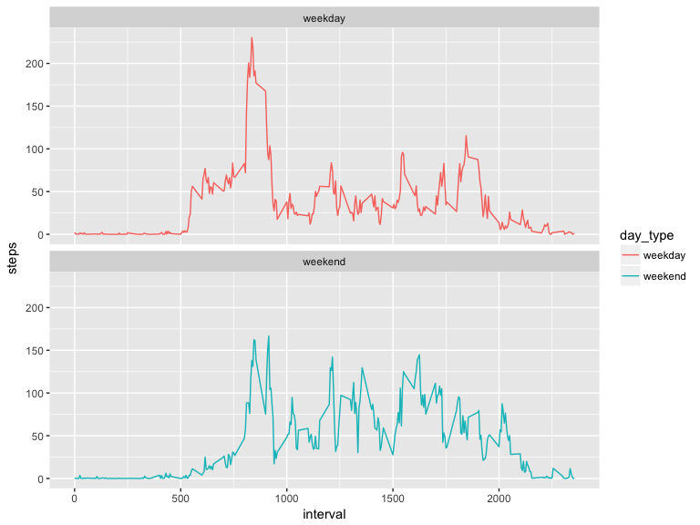

# Reproducible Research: Peer Assessment 1


## Loading and preprocessing the data
First, let's load the data.

```r
unzip("./activity.zip")
activity <- read.csv("./activity.csv")
```

Load the necessary packages to group data and group by date

```r
library(dplyr)
```

```
## 
## Attaching package: 'dplyr'
```

```
## The following objects are masked from 'package:stats':
## 
##     filter, lag
```

```
## The following objects are masked from 'package:base':
## 
##     intersect, setdiff, setequal, union
```

```r
by_day <- group_by(activity, date)
```

## What is mean total number of steps taken per day?
Find the total number of steps for each day

```r
sums_by_day <- summarize(by_day, sum=sum(steps))
```

Create a histogram and add a line at the mean number of steps per day. The
vertical magenta line indicates the mean number of daily steps.

```r
hist(sums_by_day$sum, xlab="Number of steps per day", main="Distribution of number of daily steps")
abline(v=mean(sums_by_day$sum, na.rm=TRUE), col='magenta', lwd=4)
```

<!-- -->


```r
mean_steps <- mean(sums_by_day$sum, na.rm=TRUE)
median_steps <- median(sums_by_day$sum, na.rm=TRUE)
```
The mean number of steps per day is 1.0766189\times 10^{4} and the median number of steps per day is 10765.

## What is the average daily activity pattern?
Now let's look at the average number of steps taken during each five minute interval. 

```r
by_interval <- group_by(activity, interval)
avg_by_interval <- summarize(by_interval, mean=mean(steps, na.rm=TRUE))
with(avg_by_interval, plot(interval, mean, type='l', ylab='Mean number of steps', main="Mean number of steps per interval"))
```

<!-- -->

```r
max_interval <- avg_by_interval$interval[avg_by_interval$mean %in% max(avg_by_interval$mean)]
```
The 5 minute interval that contains the maximum average number of steps is 835.

## Imputing missing values
We next want to examine the number of NA's in the dataset and replace them. 

```r
total_na <- table(rowSums(is.na(activity)))
print(total_na)
```

```
## 
##     0     1 
## 15264  2304
```
In this case, 0 corresponds to False and 1 corresponds to True. Therefore, there are 2304 NA values in the dataset.

Let's replace the NA value with the mean for the corresponding interval. 

```r
activity_2 <- activity  
na_steps <- is.na(activity_2$steps)
mean_interval <- tapply(activity_2$steps, activity_2$interval, mean, na.rm=TRUE, simplify=TRUE)
activity_2$steps[na_steps] <- mean_interval[as.character(activity_2$interval[na_steps])]
```

Then check to make sure there are no more NA values in the steps column

```r
sum(is.na(activity_2$steps))
```

```
## [1] 0
```

Now that we've replaced NA values with the mean for the corresponding interval, we will replot the histogram and calculate the mean and median number of steps per day. Again, the vertical line represents the mean number of steps per day.

```r
new_by_day <- group_by(activity_2, date)
new_sums_by_day <- summarize(new_by_day, sum=sum(steps))
hist(new_sums_by_day$sum, xlab="Number of steps per day", main="Distribution of number of daily steps")
abline(v=mean(new_sums_by_day$sum, na.rm=TRUE), col='magenta', lwd=4)
```

<!-- -->


```r
new_mean_steps <- mean(new_sums_by_day$sum, na.rm=TRUE)
new_median_steps <- median(new_sums_by_day$sum, na.rm=TRUE)
```
Now, the mean number of steps per day is 1.0766189\times 10^{4} and the median number of steps per day is 1.0766189\times 10^{4}.
You can see that by replacing NA values with the mean number of steps for that interval makes the mean and median number of steps the same.


## Are there differences in activity patterns between weekdays and weekends?
Finally, let's look at whether there is a difference in activity level on weekdays versus weekends. We first need to create a new column that classifies each date as a weekend or weekday.

```r
library(lubridate)
```

```
## 
## Attaching package: 'lubridate'
```

```
## The following object is masked from 'package:base':
## 
##     date
```

```r
activity_2$date <- ymd(activity_2$date)
activity_2 <- mutate(activity_2, day_type=ifelse(weekdays(activity_2$date) == "Saturday" | weekdays(activity_2$date) == 'Sunday', 'weekend', 'weekday'))
```
Now, generate the plot showing the average number of steps in each interval on weekdays and weekends.

```r
library(ggplot2)
```

```
## Warning: package 'ggplot2' was built under R version 3.3.2
```

```r
day_type_means <- activity_2 %>% group_by(interval, day_type) %>% summarize(steps=mean(steps))
g <- ggplot(day_type_means, aes(interval, steps, color=day_type))
g + geom_line() + facet_wrap(~day_type, ncol=1, nrow=2)
```

<!-- -->


From these plots, we can see that on weekends, this individual accumulates a steady
number of steps throughout the day, whereas on weekdays, they have a large spike
in number of steps early in the day, then accumulates a lower amount of steps
throughout the remainder of the day.
